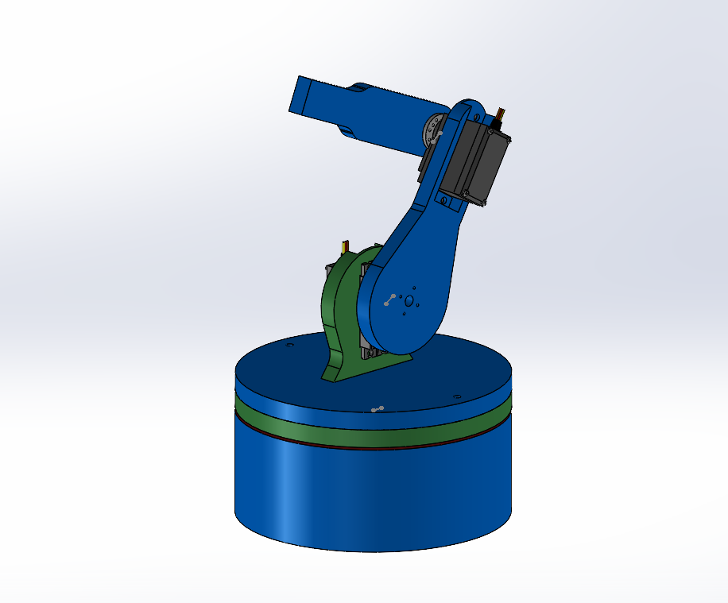
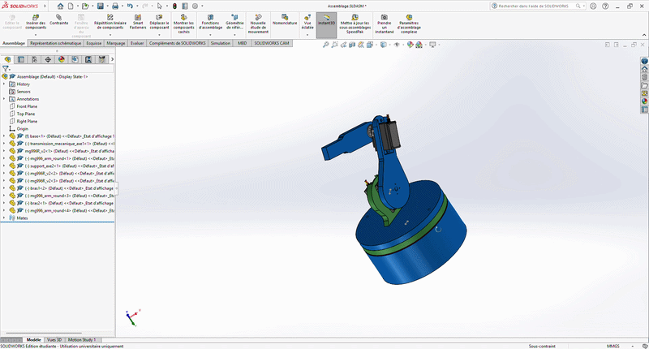
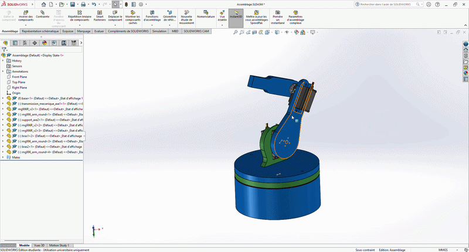

# Conception mécanique du bras robot

## Présentation
Ce dossier contient l'ensemble de la conception mécanique du bras robot réalisée sous SolidWorks.

L'objectif est de développer un bras robotique éducatif et expérimental permettant l'étude :

- de la cinématique des manipulateurs
- de la mécatronique
- du contrôle de mouvement
- de l'intégration électronique

---
## Aperçu général

---

## Architecture
Le bras est composé de :

1. Base rotative
2. Épaule
3. Coude

Nombre de degrés de liberté : **3 DOF**

## Cinématique
Le mouvement du bras repose sur :

- rotation de la base
- articulation de l'épaule
- articulation du coude

## Vidéos
### Présentation du bras

### Démonstration des mécanismes

## Fabrication
Prévu pour :

- impression 3D
- assemblage du robot physique
- intégration de servomoteurs

## État d'avancement
- [x] Modélisation SolidWorks
- [x] Assemblage complet
- [x] Validation cinématique
- [ ] Impression 3D
- [ ] Assemblage physique
- [ ] Tests de mouvement